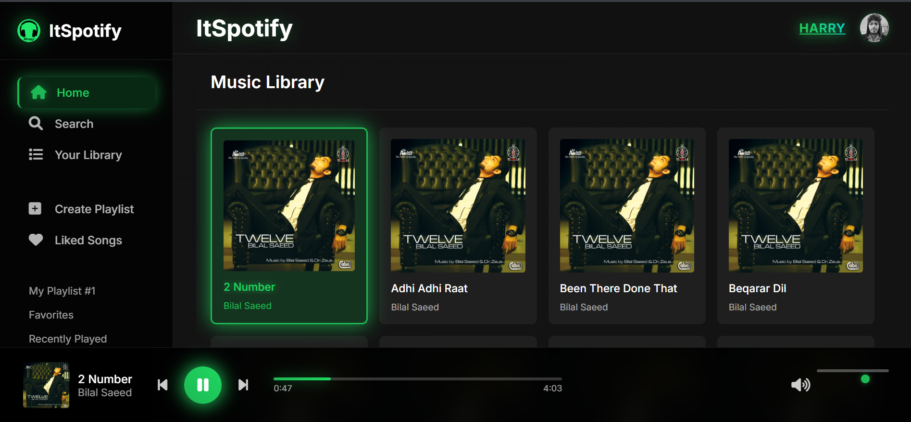
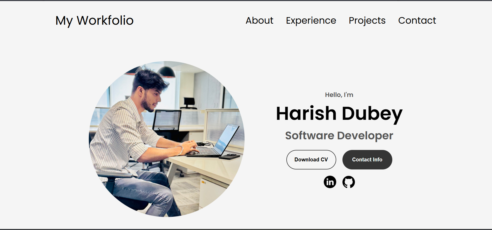

# Hi, I'm Harish 👋 
### Java and Spring Boot Developer with also expertise in RAG, Docker, Microservices, and AI-driven features.

A Software Developer with a passion for developing scalable web applications 
and working across the full stack. I'm always looking for an opportunity to work 
for an organization and utilize my skills acquired for self-development and the 
growth of the organization. 

💻 I’m interested in Java & Spring Boot application development. 
🤝 I’m looking to collaborate on development projects. 
📚 I’m currently learning DSA.

### 📬 Reach Me

 

### 🛠️ Technology Stack

### 📊 GitHub Stats

  
 

  

  

### 🏆 GitHub Trophies

  

### 📈 Contribution Graph

### 👀 Profile Views

  

---

# 🚀 My Deployed Projects & Products

<table>
<tr>
<td width="50%">

## 🚌 Busotrip
A full-stack Bus Ticket Booking Application with secure authentication and modern UI.

🔗 https://busotrip.netlify.app/login

 

</td>

<td width="50%">
 
## 🤖 UniBot Pro
An AI-powered platform featuring smart assistant capabilities and document analysis.

🔗 https://unibot-pro.onrender.com/login

 

</td>
</tr>

<tr>
<td width="50%">

## 🎵 Personal Music Player
A responsive music streaming web application inspired by Spotify UI/UX.

🔗 https://myitspotify.netlify.app/

 

</td>

<td width="50%">

## 🧠 RAG ChatBot
A Retrieval-Augmented Generation based chatbot supporting document uploads and AI responses.

🔗 https://huggingface.co/spaces/HarishDubey98/RAG_Chatbot

 

</td>
</tr>

<tr>
<td width="100%" align="center">

## 🌐 My Workfolio
My personal portfolio showcasing projects, technical skills, and experience.

🔗 https://harishdubeyofficial.netlify.app/

 

</td>
</tr>
</table>

---
